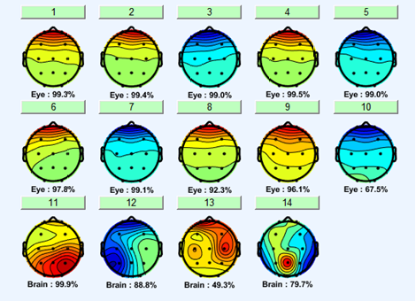
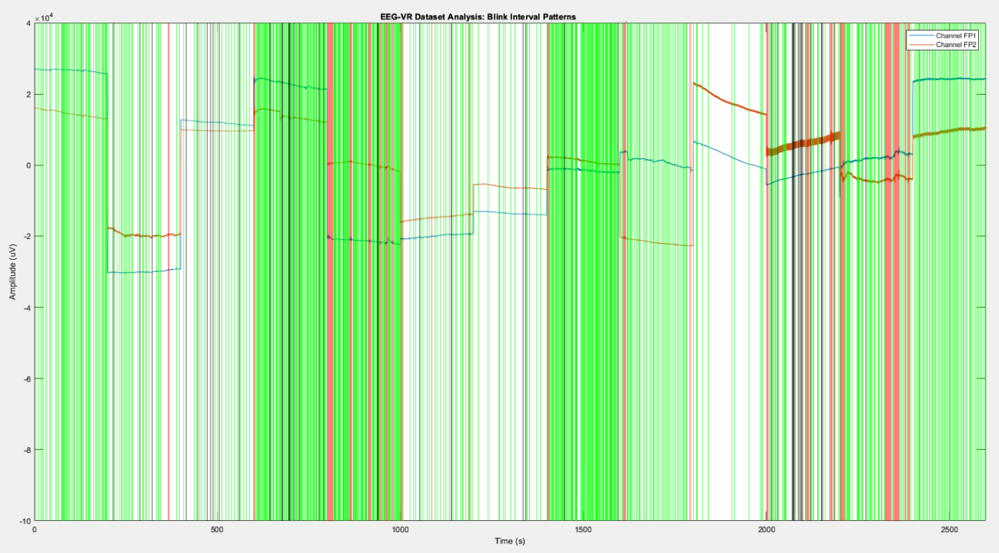
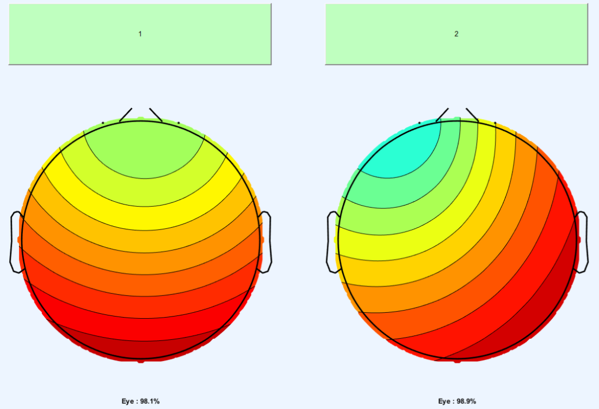

# BCI - Final Project

This work is prepared to meet the requirements of the course 11120ISA557300: Brain Computer Interfaces: Fundamentals and Application, instructed by Prof. Chun-Hsiang Chuang

## Authors

- Didier Salazar 利葉 111065427
- Edwin Sanjaya 陳潤烈 110065710
- Gabriela Herrera 凱碧 111065421

## Table of contents

- [Introduction](#introduction)
- [Demo Video](#demo-video)
- [Dataset](#dataset)
- [Model Framework](#model-framework)
- [Validation](#validation)
- [Usage](#usage)
- [Results](#results)
- [References](#references)

## Introduction

Brain-computer interfaces (BCIs) are systems that use EEG (Electroencephalography) data to enable users to interact with external devices and varied technologies. The user's neural activity can be analyzed under different conditions and stimuli to find correlations and identify related neural signals that can be translated to instructions. Recent advancements in eye tracking technologies and research on integrating gaze information with blinking patterns have shown promise in enhancing users' ability to intuitively select options when controlling the device or technology. In line with these advancements, we propose a project to develop a system that analyzes neural activity related to the voluntary blinking, which can be utilized as a mechanism in interaction with computers.

This project focuses on leveraging the brain-computer interface technology to develop a system that can consistently identify voluntarily blinking with the aim of enhancing accessibility by providing an alternative method for option selection. To achieve this our main objectives are:

- Identify the features in the EEG signal which can be reliable for eye blinking classification.
- Develop the pre-processing framework to enhance the signal quality of the EEG dataset while eliminating the noise.
- Develop a machine learning model to classify different types of eye blinking.
- Evaluating and fine-tuning the accuracy of our system in classifying the different neural signals into voluntary blinking and involuntary blinking.

## Demo Video

_video here_

## Dataset

In this project, we worked with two datasets, both named EyeBlinkDataset. To simplify the reference, we distinguished them based on their place of publication: one dataset was published in the Neurocomputing journal, while the other dataset was available on the webpage of the Georgia Tech Networks And Mobile Computing Research Group (GNAN).

### Neurocomputing EyeblinkDataset

We utilized the dataset developed by Suguru Kanoga, Masaki Nakanishi, and Yasue Mitsukura as documented in their research paper titled "Assessing the effects of voluntary and involuntary eyeblinks in independent components of electroencephalogram" [[1]](#references). To acquire the dataset, we communicated with the authors and obtained the dataset "EyeblinkDataset" directly from their Google Drive.

The data was collected from 14 channels (Fp1, Fp2, F3, F4, T3, C3, Cz, C4, T4, P3, Pz, P4, O1, and O2) according to the 10–20 system + 1 EOG signal.
 

 

The dataset corresponds to twenty subjects (14 males and 6 females, mean age: 22.75±1.45 years, 14 right and 6 left eye dominants). As detailed in the paper[[1]](#references), the signals were acquired using active electrodes made of sintered Ag/Ag–Cl material (manufactured by g.tec Medical Engineering GmbH, Austria) were used, with their metallic tips securely attached to the scalp. Two surface Ag/Ag–Cl electrodes (Blue Sensor P, Ambu Corp., Denmark) were placed at the superior and inferior orbital rims of the left eye to record the vertical EOG signal. The left mastoid and Fz served as the reference and ground electrodes, respectively. To ensure accurate signal capture, the EEG and EOG data were band-pass filtered from 0.5 Hz to 60 Hz using a Butterworth filter. The signals were then digitized at a sampling rate of 256 Hz using the g.USBamp system. The first 5 seconds of recorded data were discarded as they were deemed unreliable. To reduce skin resistance and ensure good electrode-skin contact, all electrodes were coated with an electrolyte called g.GAMMAgel.

The experiments to collect the data are specified in the paper and a useful diagram has also been included here. For voluntary eyeblinks, an audio stimulus was used, and participants were instructed to blink within 1 second of hearing the beep sound while focusing on a fixation point. The study comprised three sessions with 20 trials each, separated by rest periods. The sound presentation intervals were selected to capture sustained effects on EEG signals while minimizing interference. In the case of involuntary eyeblinks, three different sounds ("A," "S," and "D") at specific frequencies and volume were employed. Participants placed their left fingertips on corresponding keyboard keys, responding to the presented sound. Feedback and performance rates were provided after 20 trials, aiming for a 90% accuracy rate. Natural blinking was allowed, and three sessions were conducted.

Source: (Kanoga et al., 2016)

In our analysis of the EEG data, we conducted time and frequency domain analyses. For the time domain, we plotted the EEG signals for each channel, showing their amplitude over time. In the frequency domain, we computed the FFT of the signals to visualize their magnitude spectra. Additionally, we calculated the event-related spectral perturbation (ERSP) using spectrogram calculations. We plotted the average ERSP over time and frequency, as well as the ERSP of a single epoch. These analyses provided insights into the characteristics and variations of the EEG signals.
 

 

#### Quality Evaluation: literature survey and analysis

The dataset provide a lot of contribution in the BCI research with 27 citations, some of the notable contribution for other research are:

- [Simultaneous Eye Blink Characterization and Elimination From Low-Channel Prefrontal EEG Signals Enhances Driver Drowsiness Detection](https://ieeexplore.ieee.org/abstract/document/9484745) as real dataset for generating an algorithm for eye blink detection and elimination
- [EEGdenoiseNet: a benchmark dataset for deep learning solutions of EEG denoising](https://iopscience.iop.org/article/10.1088/1741-2552/ac2bf8) where the dataset become a the part of EEGdenoiseNet, a dataset suitable for deep learning based EEG denoising research)
- [Machine learning classifier for eye-blink artifact detection](https://www.sciencedirect.com/science/article/pii/S2772528622000772) as real dataset for comparative analysis between machine-learning classifiers on eye-blink detection
- And other [citations](https://scholar.google.com/scholar?oi=bibs&cites=5737901810583805697) as well

In addition, the main author of the paper has a high credibility:

- Ph.D. degree in Engineering, Graduate School of Integrated Design Engineering, Keio University, Japan
- 7+ years of research experience
- Google Scholar Page: https://scholar.google.com/citations?user=69k7XzYAAAAJ

#### Analyzing the hidden independent components within EEG using ICA with ICLabel

The dataset was created by the original authors of the paper through a series of processing steps. They initially filtered the recorded EOG signals using a low-pass filter (Butterworth, cutoff frequency: 8.0 Hz) to reduce cerebral activities. Then, they detected the first positive peaks of blinks in the filtered EOG signals using a hard threshold (threshold value: 50 μV) and visually inspected these peaks to confirm their validity. The authors then segmented the eyeblink features and vertical EOG signals into 4-second epochs based on the point of maximum amplitude in the EOG data.

During our analysis, we applied Independent Component Analysis (ICA) to the EEG epoch data and used ICLabel for automatic labeling. It's important to note that the components we obtained were specifically related to brain and eye activities, reflecting the processing steps conducted by the original authors. So we wish to clarify, when we mention "raw" data, we are referring to the data that includes the processing performed by the original authors, without any additional processing from our side.

We compared the number of identified ICs in the dataset obtained from the "raw" data provided by the authors, as well as the dataset after applying bandpass filtering and Artifact Subspace Reconstruction (ASR) correction. We observed slight differences between these datasets. To gain further insights into the changes within the datasets, we also examined the probabilities shown by the ICA, which were influenced by our additional processing steps of bandpass filtering and ASR correction.

<table>
  <tr>
    <td>&nbsp;</td>
    <td colspan="2" align="center">
      Pre-processing
    </td>
    <td colspan="7" align="center">
      Average numbers of ICs classified by ICLabel
    </td>
  </tr>
  <tr>
    <td>EEG (14 Channels & Eyeblink Dataset)</td>
    <td align="center">bandpass filter</td>
    <td align="center">ASR</td>
    <td align="center">Brain</td>
    <td align="center">Muscle</td>
    <td align="center">Eye</td>
    <td align="center">Heart</td>
    <td align="center">Line Noise</td>
    <td align="center">Channel Noise</td>
    <td align="center">Other</td>
  </tr>
  <tr>
    <td>Raw</td>
    <td align="center">&nbsp;</td>
    <td align="center">&nbsp;</td>
    <td align="center">4</td>
    <td align="center">0</td>
    <td align="center">10</td>
    <td align="center">0</td>
    <td align="center">0</td>
    <td align="center">0</td>
    <td align="center">0</td>
  </tr>
  <tr>
    <td>Filtered</td>
    <td align="center">v</td>
    <td align="center">&nbsp;</td>
    <td align="center">4</td>
    <td align="center">0</td>
    <td align="center">10</td>
    <td align="center">0</td>
    <td align="center">0</td>
    <td align="center">0</td>
    <td align="center">0</td>
  </tr>
  <tr>
    <td>ASR-corrected</td>
    <td align="center">v</td>
    <td align="center">v</td>
    <td align="center">6</td>
    <td align="center">0</td>
    <td align="center">6</td>
    <td align="center">0</td>
    <td align="center">0</td>
    <td align="center">0</td>
    <td align="center">2</td>
  </tr>
</table>

Upon examining the results, we can observe that applying ASR to the filtered data yields less accurate detection of independent components, with some components being categorized as "others," which is not ideal. This can be attributed to the ASR algorithm and its impact on the data. The ASR correction process has the potential to remove or weaken EEG components associated with eye activities or other artifacts, as well as alter the spatial distribution and temporal characteristics of the remaining ICs. Consequently, this leads to a decrease in the number of identified ICs related to these artifacts. Its objective is to eliminate artifacts and optimize the signal-to-noise ratio, resulting in changes to the ICs' amplitude, shape, and timing. Since the dataset provided by the authors had been pre-processed, these ARS related alterations can potentially negatively affect the interpretation and identification of the ICs.

<table>
  <tr>
    <td align="center">Raw</td>
    <td></td> 
  </tr>
  <tr>
    <td align="center">Filtered</td>
    <td></td>
  </tr>
  <tr>
    <td align="center">ASR-corrected</td>
    <td></td>
  </tr>
</table>

Based on our analysis and evaluation of the data, we have determined that our pre-processing steps do not improve the Independent Component Analysis (ICA) results. Therefore, it is concluded that the best course of action is to continue utilizing the raw data provided by the authors.

### Georgia Tech Networks And Mobile Computing Research Group (GNAN) EyeblinkDataset

A public dataset comprising three different groups of eye-blink related data, EEG-IO, EEG-VV, and EEG-VR, was utilized. The EEG-IO dataset included voluntary single eye-blinks triggered by external stimulation, recorded from the frontal electrodes (Fp1, Fp2) for 20 subjects using OpenBCI Device and BIOPAC Cap100C. Each subject participated in a single session, which involved approximately 25 blinks. The EEG signals in this dataset were manually annotated using a video feed.

The EEG-VV and EEG-VR datasets consisted of involuntary eye-blinks (natural blinks) recorded from the frontal electrodes (Fp1, Fp2) for 12 subjects using OpenBCI Device and BIOPAC Cap100C. The subjects performed two activities: watching a video (EEG-VV) and reading an article (EEG-VR). The eye-blinks in these datasets were also manually annotated using a video feed.

<table>
  <tr>
    <td align="center">EEG-IO Blink interval patterns</td>
    <td>
      
    </td>
  </tr>
  <tr>
    <td align="center">EEG-VR Blink interval patterns</td>
    <td>
      
    </td>
  </tr>
  <tr>
    <td align="center">EEG-VV Blink interval patterns</td>
    <td>
      
    </td>
  </tr>
</table>

#### Quality Evaluation: literature survey and analysis

The dataset provide some contribution in the BCI research, some of the notable contribution are:

- Blink: A Fully Automated Unsupervised Algorithm for Eye-Blink Detection in EEG Signals, Mohit Agarwal and Raghupathy Sivakumar, 57th Annual Allerton Conference on Communication, Control, and Computing, 2019[PDF](https://proceedings.allerton.csl.illinois.edu/media/files/0174.pdf)
- Charge for a whole day: Extending Battery Life for BCI Wearables using a Lightweight Wake-Up Command,Mohit Agarwal and Raghupathy Sivakumar,CHI '20: Proceedings of the 2020 CHI Conference on Human Factors in Computing System, 2020[PDF](https://dl.acm.org/doi/pdf/10.1145/3313831.3376738)
- Blink to Get In: Biometric Authentication for Mobile Devices using EEG Signals,Ekansh Gupta, Mohit Agarwal, and Raghupathy Sivakumar,ICC 2020 - 2020 IEEE International Conference on Communications , 2020[PDF](https://ieeexplore.ieee.org/stamp/stamp.jsp?tp=&arnumber=9148741&tag=1)

In addition, the authors of the papers have high credibility:

- Mohit Agarwal - Quant Strat at GS | PhD from GT, Google Scholar Page: https://scholar.google.com/citations?user=qB4EgbAAAAAJ&hl=en&oi=sra
- Raghupathy Sivakumar - Wayne J. Holman Chair Professor, School of Electrical and Computer Engineering, Georgia Tech, Google Scholar Page: https://scholar.google.com/citations?user=FGB5FvgAAAAJ&hl=en&oi=sra
- Ekansh Gupta - PhD Student, Georgia Tech, Google Scholar Page: https://scholar.google.com/citations?user=HShuFkgAAAAJ&hl=en&oi=sra

#### Analyzing the hidden independent components within EEG using ICA with ICLabel

During our analysis, we conducted Independent Component Analysis (ICA) on the EEG epoch data and utilized ICLabel for automatic labeling. The components we obtained were specifically associated with eye activities. This is expected since the original dataset solely contained data from the Fp1 and Fp2 channels, which are known to be related to eye signals.

We performed a comparison of the number of identified ICs in the dataset obtained from the raw data provided by the authors, as well as the dataset after applying bandpass filtering and Artifact Subspace Reconstruction (ASR) correction. Interestingly, we observed no discernible difference in the classification of the identified components, as both were identified as eye-related components. However, we did notice slight variations in the accuracy of these datasets. To gain further insights into the changes within the datasets, we also examined the probabilities generated by the ICA. These probabilities were influenced by our additional processing steps, including bandpass filtering and ASR correction.

<table>
  <tr>
    <td>&nbsp;</td>
    <td colspan="2" align="center">
      Pre-processing
    </td>
    <td colspan="7" align="center">
      Average numbers of ICs classified by ICLabel
    </td>
  </tr>
  <tr>
    <td>EEG (2 Channels & Combined Eyeblink Dataset)</td>
    <td align="center">bandpass filter</td>
    <td align="center">ASR</td>
    <td align="center">Brain</td>
    <td align="center">Muscle</td>
    <td align="center">Eye</td>
    <td align="center">Heart</td>
    <td align="center">Line Noise</td>
    <td align="center">Channel Noise</td>
    <td align="center">Other</td>
  </tr>
  <tr>
    <td>Raw</td>
    <td align="center">&nbsp;</td>
    <td align="center">&nbsp;</td>
    <td align="center">0</td>
    <td align="center">0</td>
    <td align="center">2</td>
    <td align="center">0</td>
    <td align="center">0</td>
    <td align="center">0</td>
    <td align="center">0</td>
  </tr>
  <tr>
    <td>Filtered</td>
    <td align="center">v</td>
    <td align="center">&nbsp;</td>
    <td align="center">0</td>
    <td align="center">0</td>
    <td align="center">2</td>
    <td align="center">0</td>
    <td align="center">0</td>
    <td align="center">0</td>
    <td align="center">0</td>
  </tr>
  <tr>
    <td>ASR-corrected</td>
    <td align="center">v</td>
    <td align="center">v</td>
    <td align="center">0</td>
    <td align="center">0</td>
    <td align="center">2</td>
    <td align="center">0</td>
    <td align="center">0</td>
    <td align="center">0</td>
    <td align="center">0</td>
  </tr>
</table>

Upon examining the results, we can observe that applying ASR to the filtered data yields more accurate detection of independent components.

<table>
  <tr>
    <td align="center">Raw</td>
    <td>
      
    </td>
  </tr>
  <tr>
    <td align="center">Filtered</td>
    <td>
      
    </td>
  </tr>
  <tr>
    <td align="center">ASR-corrected</td>
    <td>
      
    </td>
  </tr>
</table>

## Model Framework

_Outline the architecture and components of your BCI system. This includes the input/output mechanisms, signal preprocessing techniques, data segmentation methods, artifact removal strategies, feature extraction approaches, machine learning models utilized, and any other relevant components._

Taking into account that the dataset has already been labeled, supervised learning was used to
create a model that can classify voluntary and involuntary blinking. We explored various
models of supervised learning and apply the experiment on each of them. This approach provided valuable insights
since employing multiple models facilitated a comparison of their performance and helped identify the
model that best suited the data.
Our system framework works as follows:

1. Preprocessing of the data: we use band-pass filtering to supress the signal with frequency above 50Hz and ASR for noise-removal.
   Having a clean EEG signal is crucial to train our model in eye-blinking classification 
2. Feature engineering: the exploration of different features to be used for model training, such as peak:
   - Signal properties:
     - Statistical properties: Mean, Median, Min, Max, Range, Standard Deviation, Variance
     - Kurtosis
     - Skew
     - Entropy
   - Power spectral density
     - Check for different properties in each frequency bands (Delta, Theta, Alpha, Beta, Gamma)
     - Statistical properties: Mean, Min, Max, Range
3. Machine learning model development: the preprocessed data and selected features were used to
   generate the supervised learning models, we use the following models to work as our classifier:
   - Logistic Regression
   - Random Forest
   - Support Vector Machine
   - XGBoost
   - XGBoost Random Forest
   - Linear Discriminant Analysis
   - K-Nearest Neighbors
   - Recurrent Neural Network
4. Evaluation: 70% of the dataset were used as a training set to train our model, after the model is trained, the rest 30% of the dataset were used as a testing/validation set (15% validation and 15% testing for neural network. We will apply the same procedure for each model, their performance results were to determine the most effective model to be used for our BCI system.
5. Fine-tuning:

## Validation

_Describe the methods used to validate the effectiveness and reliability of your BCI system._

Since we are working on the classifier to determine whether an eye-blink is voluntary and involuntary, 
accuracy will be sufficient as the main metrics to determine our BCI system performance.
Accuracy provides direct measure of how frequently our model is correct and easy to be understood.
In addition, since our data are relatively balanced, accuracy will not be biased in the certain class
and won't require us to complicate our evaluation by using other metrics such as precision, recall and F1-score

$$
\text{Accuracy} = \frac{\text{TP} + \text{TN}}{\text{TP} + \text{TN} + \text{FP} + \text{FN}}
$$

Where:
- TP: True Positives: Voluntary eye-blink classified as voluntary eye-blink
- TN: True Negatives: Involuntary eye-blink classified as involuntary eye-blink
- FP: False Positives: Involuntary eye-blink classified as voluntary eye-blink
- FN: False Negatives: Voluntary eye-blink classified as involuntary eye-blink

## Usage

_Describe the usage of their BCI model's code._

### Environment & Dependencies

_Explain the required environment and dependencies needed to run the code. Describe any configurable options or parameters within the code._

Used software application:
1. Jupyter Notebook: Works as a user interface for the classifier
2. Python v3.11: To run the python programs and libraries, mainly working on feature extraction and classification
3. MATLAB R2023a: To pre-process the EEG signal before processed by Python

### Configurable Options & Parameter

### How to Execute the Code

1. Have Jupyter Notebook, Jupyter and Python installed in the local device
2. Install the required Python dependencies from requirement.txt
3. Run main.ipynb 

## Results

_Present a detailed comparison and analysis of your BCI system's performance against the competing methods. Include metrics such as accuracy, precision, recall, F1-score, or any other relevant evaluation metrics. Compare and contrast your BCI system with existing competing methods. Highlight the advantages and unique aspects of your system._

The following table represent the accuracy of the voluntary & involuntary blink classifier by using different models:
<table>
   <tr>
      <th>Model</th>
      <th>Accuracy</th>
   </tr>
   <tr>
      <td>Logistic Regression</td>
      <td align="center">0%</td>
   </tr>
   <tr>
      <td>Random Forest</td>
      <td align="center">0%</td>
   </tr>
   <tr>
      <td>Support Vector Machine</td>
      <td align="center">0%</td>
   </tr>
   <tr>
      <td>XGBoost</td>
      <td align="center">0%</td>
   </tr>
   <tr>
      <td>XGBoost Random Forest</td>
      <td align="center">0%</td>
   </tr>
   <tr>
      <td>Linear Discriminant Analysis</td>
      <td align="center">0%</td>
   </tr>
   <tr>
      <td>K-Nearest Neighbors</td>
      <td align="center">0%</td>
   </tr>
   <tr>
      <td>Recurrent Neural Network</td>
      <td align="center">0%</td>
   </tr>
</table>

Based on the experiment, by having the dataset

- Using only two-channel (Fp1 and Fp2) is quite challenging for the non-neural network classifier to differentiate 
the voluntary and involuntary eye-blinking
- However, the recurrent neural network model provides a reliable result to differentiate the voluntary and involuntary eye-blinking

## References

1. Kanoga, S., Nakanishi, M., & Mitsukura, Y. (2016). Assessing the effects of voluntary and involuntary eyeblinks in independent components of electroencephalogram. Neurocomputing, 193, 20-32. [https://doi.org/10.1016/j.neucom.2016.01.057](https://doi.org/10.1016/j.neucom.2016.01.057)
2. Agarwal, Mohit & Sivakumar, Raghupathy. (2019). Blink: A Fully Automated Unsupervised Algorithm for Eye-Blink Detection in EEG Signals. 1113-1121. 10.1109/ALLERTON.2019.8919795. [https://doi.org/10.1109/ALLERTON.2019.8919795](https://doi.org/10.1109/ALLERTON.2019.8919795)
3. Agarwal, Mohit & Sivakumar, R.. (2020). Charge for a whole day: Extending Battery Life for BCI Wearables using a Lightweight Wake-Up Command. 1-14. 10.1145/3313831.3376738.
4. Gupta, Ekansh & Agarwal, Mohit & Sivakumar, R.. (2020). Blink to Get In: Biometric Authentication for Mobile Devices using EEG Signals. 1-6. 10.1109/ICC40277.2020.9148741.
